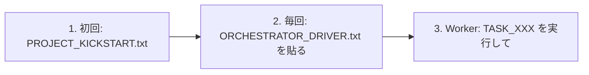
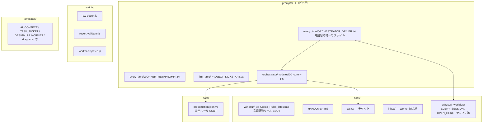

# shared-workflows

共通の開発ワークフローと AI 協調開発ルール（Single Source of Truth）を提供する中央リポジトリです。

## クイックスタート（3ステップ）

1. **初回のみ**: `prompts/first_time/PROJECT_KICKSTART.txt` で `.shared-workflows/` を Submodule 導入
2. **毎回**: `prompts/every_time/ORCHESTRATOR_DRIVER.txt` を Orchestrator スレッドに貼る（**これだけ**）
3. **Worker 委譲**: 「TASK_007 を実行して」の1行で Worker が自律実行（詳細: `EVERY_SESSION.md` §3）

端末統一（推奨）: `prompts/global/WINDSURF_GLOBAL_RULES.txt` を Windsurf Global Rules に設定。

## リポジトリ構造

## 主要ファイル

| 用途 | ファイル |
|------|---------|
| **毎回貼るプロンプト** | `prompts/every_time/ORCHESTRATOR_DRIVER.txt` |
| **協調開発ルール（SSOT）** | `docs/Windsurf_AI_Collab_Rules_latest.md` |
| **表示ポリシー（SSOT）** | `data/presentation.json`（v3） |
| **運用 SSOT** | `docs/windsurf_workflow/EVERY_SESSION.md` |
| **運用者の入口** | `docs/windsurf_workflow/OPEN_HERE.md` |
| **Worker テンプレ** | `docs/windsurf_workflow/WORKER_PROMPT_TEMPLATE.md` |
| **チケット雛形** | `templates/TASK_TICKET_TEMPLATE.md` |
| **設計原則** | `templates/DESIGN_PRINCIPLES.md` |
| **スクリプト一覧** | `scripts/README.md` |

## 参照ナビ

| いつ | 見るべきファイル |
|------|----------------|
| 迷ったら | `OPEN_HERE.md` → `EVERY_SESSION.md` |
| 作業開始 | `AI_CONTEXT.md` → `HANDOVER.md` → `docs/tasks/` |
| タスク委譲 | `EVERY_SESSION.md` §3 / `worker-dispatch.js` |
| レポート検証 | `node scripts/report-validator.js <REPORT>` |
| 環境診断 | `node scripts/sw-doctor.js` |
| 巡回監査 | `node scripts/orchestrator-audit.js` |
| CI 失敗 | `templates/ROLE_PROMPT_CI_HANDLER.md` |

## バックログ管理（Issue 同期）

`docs/ISSUES.md` を編集 → `main` に push → GitHub Actions で自動同期。手動実行も可。

## 関連リンク

- [協調開発ルール（SSOT）](./docs/Windsurf_AI_Collab_Rules_latest.md)
- [Issue 同期バックログ](./docs/ISSUES.md)
- [文字化け修正ガイド](./docs/ENCODING_FIX_GUIDE.md)

v2.0 → v3.0 変更履歴

### v3.0（現在）
- プロンプト体系簡素化（DRIVER 86→44行、METAPROMPT.md をリファレンス降格、WORKER_METAPROMPT 107→51行）
- docs/ 構造整理（レガシー10件を archive/、AHK 3件を ahk/ に移動）
- presentation.json v3（テンプレスニペット、fallback_templates 追加）
- scripts/README.md 新設（機能マップ）
- ARCHIVE_POLICY.md 新設

### v2.0
- CI成功 = 即座に自動マージの単純ルール
- クリーンアップチェック義務化
- コマンド実行ポリシー（ローカル安全コマンドは AI 自律実行）
- レポート出力フォーマット統一（presentation.json v2）
- タスク委譲ショートカット
- データ外部化原則
- 学習者向け可読性向上（Mermaid図、Before/After）

