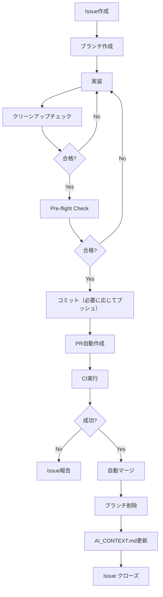

# Windsurf: AI 協調開発ルール v2.0

## 変更サマリー（v1.1 → v2.0）

- ✅ **実行フローの完全明確化**: 各ステップで「自動実行 or 待機」を明示
- ✅ **クリーンアップの義務化**: PR作成前の必須チェックリストを追加
- ✅ **簡易化**: Tier分類を簡素化し、判断の曖昧性を排除
- ✅ **自動マージの確実性**: CI成功 → 即座に自動マージの単純フロー
- ✅ **中断禁止ゾーン**: PR作成からマージまで人間の介入を不要に

---

## 0. 起動シーケンス

### AIの起動時動作（毎回必ず実行）

1. **AI_CONTEXT.md の読み込み**: プロジェクトルートの `AI_CONTEXT.md` を最初に読む
2. **オーケストレーション用プロンプト（任意）の読み込み**: プロジェクトルートの `ORCHESTRATION_PROMPT.md` を運用している場合は読む（テンプレ: `templates/ORCHESTRATION_PROMPT.md`）
3. **ミッション確認**: 現在のミッションと進捗を把握
4. **継続 or 新規判定**: 継続作業なら中断可能点から再開、新規ならIssue作成から開始

### AI_CONTEXT.md が存在しない場合

- 付録Aのテンプレートに従って自動生成（Tier 1操作）
- プロジェクトルートに配置し、初期状態を記録

---

## 1. 基本原則

### 1.1 作業の起点

- **すべての作業はIssueから開始**: 抽象的な要求もIssueに変換
- **AI自律Issue起票**: AIはコード分析・将来提案に基づきIssueを自律的に作成可能

### 1.2 応答言語

- **すべての応答は日本語**: ドキュメント、コミットメッセージ、PR本文すべて日本語

### 1.3 タスク駆動開発

- 大項目/中項目/小項目に分解
- 進捗を `AI_CONTEXT.md` に記録
- 区切りごとにコミットし、共有が必要な場合はプッシュする（外部通信のため必要に応じて承認）

### 1.4 コマンド実行ポリシー（高速化）

- **原則**: AI は作業を止めずに進めるため、ローカルで安全なコマンドは自律実行してよい
  - 例: 読み取り/検索/差分確認/静的解析/テスト/ビルド/フォーマット（プロジェクト内に閉じる範囲）
- **例外**: 以下に該当する場合は事前承認を取る
  - **外部通信**（例: `git fetch/pull/push`、パッケージ取得、外部API呼び出し）
  - **破壊的/復旧困難な操作**（例: 削除、強制上書き、`reset`、`rebase`、`force push`）
  - **依存関係の追加/更新**（例: `npm install`、`pip install`）
  - **長時間/高負荷/大量出力が見込まれる操作**（目安: 数分以上、または大量ログ）

#### 運用オプション: GitHub操作を自動承認する

プロジェクト/組織の運用として「普段から push・PR作成・マージまで自動承認」する場合は、外部通信（`git fetch/pull/push` 等）や GitHub 操作について **承認待ちで停止しない** 運用にしてよい:

- 条件: 実行環境（ツール設定/CI権限/ルール）側で、GitHub操作の自動承認が有効になっている
- この場合の扱い: `git fetch/pull/push` や PR作成/マージ等は、都度の確認を省略して自律実行してよい
- ただし、`force push` / `rebase` / `reset` のような履歴破壊・復旧困難な操作は、引き続き慎重に扱い、必要なら方針確認を取る

#### 承認が必要な場合の提示フォーマット（推奨 / 任意）

AI は次の情報をまとめ、可能な限り **ワンストップ（1回の承認）** で実行できる形で提示する（状況に応じて省略・簡略化してよい）:

- **目的**: 何のために実行するか
- **実行内容**: 何をするか（概要）
- **コマンド一覧**: 実行順に列挙（必要に応じて / 省略可）
- **期待される変更**: ファイル変更の有無、外部通信の有無
- **リスク（Tier）**: 低/中/高（目安）

ユーザーが承認した場合、AI は承認範囲内で連続実行する。

#### ダブルチェック（必須）: 失敗の取りこぼし・スタック・虚偽完了の防止

以下は **効率より正確性を優先**し、毎回必ず実施する（非効率と判断した場合は後で再調整する）。

- **終了判定のダブルチェック**:
  - コマンド実行後は、必ず「終了した」ことを確認してから次に進む。
  - すでに終了しているコマンドに対して応答待ちを続けない（待機系の確認は、状態取得→必要なら再試行の順）。
  - 待機が必要な場合は、必ず **タイムアウト（上限時間）** と **打ち切り条件** を定義し、超過したら「タイムアウト」と明言して次の手を出す（無限待機しない）。
- **成功判定のダブルチェック**:
  - 成功判定は必ず **2段階** で行う:
    - 1) 実行結果（エラー表示/非0終了/拒否/競合/タイムアウト等）
    - 2) 目的状態の確認（Git状態/生成物/ログ等）
  - 「コマンドを実行した」だけでは完了にしない。
  - 失敗（エラー/非0終了/拒否/競合/タイムアウト等）が表示された場合は、
    - その場で「失敗」と明言し、
    - 失敗の根拠（エラー要点）と、
    - 次の対応（再試行/別手段/人間介入）を提示する。
- **成果物のダブルチェック**:
  - 実装・修正・運用タスクは「成果物が確認できる」ことを完了条件に含める。
  - 例:
    - **Push/Merge**: 実行後に必ず `git status` と対象ブランチ/リモートの状態を確認し、反映された事実を示す。
      - **Push の確認例**: `git status -sb` で `ahead/behind` が解消されていること、必要なら `git log -n 1 --oneline --decorate` で先頭コミットが期待どおりであることを確認する。
      - **Push の反映確認（推奨）**: `git fetch origin` の後に `git rev-list --left-right --count origin/<branch>...<branch>` を確認し、`0\t0` であることを確認する。
      - **Merge の確認例**: `git diff --name-only --diff-filter=U` が空であること、かつ `<<<<<<<` 等の競合マーカーが残っていないことを確認する。
      - **競合マーカー検出（推奨）**: `git grep -nE "^(<<<<<<<|=======|>>>>>>>)"` が空であることを確認する。
    - **テスト**: 失敗した場合は完了にせず、失敗ログの要点と修正方針を提示する。
    - **コード変更**: `git diff` 等で差分が意図どおりであることを確認し、未解決TODOや暫定コードが残っていないことを確認する。
  - **「実装完了」の禁止条件**:
    - 実際の差分（`git diff` / 変更ファイル）や動作確認（テスト/実行結果）が提示できない場合は、完了として扱わず「未完了（作業メモ/方針のみ）」と明言する。
    - 実装がうまくいかなかった場合でも、記述だけで完了扱いにしない。必ず「どこまでできたか」「何が原因で止まったか」「次に何を試すか」を残す。

---

## 2. 簡素化されたTier分類

### Tier 1（完全自律）

- ドキュメント更新（README、コメント、docs/配下）
- コードフォーマット、Linter修正
- テストの微修正（ロジック変更なし）
- AI_CONTEXT.md の更新

**実行ルール**:

Pre-flight合格後、即座に実行→コミット→（共有が必要な場合は）プッシュ

### Tier 2（自動PR→CI→自動マージ）

- 機能実装、バグ修正、リファクタリング
- 新規テストの追加
- 依存関係の更新（minor/patch）

**実行ルール**:

1. 実装→クリーンアップチェック→コミット→（共有が必要な場合は）プッシュ
2. PR自動作成
3. CI実行（AI は待機）
4. CI成功 → **即座に自動マージ**（中断禁止）
5. ブランチ削除、AI_CONTEXT.md 更新

### Tier 3（人間承認必須）

- 本番データベース変更
- 本番環境へのデプロイ
- セキュリティ設定の変更
- major バージョンアップ

**実行ルール**:

AI は PR を作成して停止。人間の明示的承認を待つ

---

## 3. 必須フロー（Tier 2の標準）

### Step 1: Issue作成

- Goal、ToDo、受入基準、影響範囲を明記
- ラベル付与（feature/bug/refactor等）

### Step 2: ブランチ作成

- 命名: `feature/ISSUE-<id>-<slug>` （例: `feature/ISSUE-123-add-auth`）
- ベースブランチから作成

### Step 3: 実装

- コードを書く
- テストを書く
- **デバッグコード/コメントアウトは一時的に追加OK**

### Step 4: クリーンアップチェック（★重要★）

**PR作成前に必ず実行する義務的チェックリスト**:

- [ ] `console.log`、`print`、`Debug.Log` などのデバッグ出力を削除
- [ ] 使用していないコメントアウトを削除
- [ ] TODO/FIXMEコメントがあれば対応 or Issue化
- [ ] 使用されていない変数/関数/import を削除
- [ ] 不要な空行を整理（連続3行以上の空行は削除）
- [ ] テストコードが本番コードに混入していないか確認

#### クリーンアップチェック失敗時の対応

PR作成禁止

### Step 5: Pre-flight Check

1. **依存関係**: lockファイルの整合性確認
2. **環境変数**: 必須変数の存在確認
3. **Linter**: エラー0件（warning は許容）
4. **テスト実行**: 全テスト成功、カバレッジ ≥ 80%
5. **セキュリティスキャン**: High/Critical の脆弱性 0件
6. **タスクチェック漏れ防止**: `scripts/todo-leak-preventer.js` でAI_CONTEXT.mdのtodo_listをチェック。pending/in_progressタスクの完了条件を自動判定。

#### Pre-flight失敗時の対応

コミット禁止

### Step 6: コミット（必要に応じてプッシュ）

- コミットメッセージ: `type(scope): description [closes #<issue>]`
- 例: `feat(auth): ログイン機能を追加 [closes #123]`

### Step 7: PR自動作成

- タイトル: Issue のタイトルに準拠
- 本文: 変更内容、テスト方法、関連Issue を記載
- ラベル自動付与

### Step 8: CI実行（AIは待機）

- GitHub Actions / GitLab CI 等が自動実行
- AIは `command_status` で定期的にCI状態を確認
- タイムアウト: 10分（10分以内に終わらない場合は Issue に報告）

### Step 9: 自動マージ（★問題解決の核心★）

**CI成功を検知した瞬間、AIは以下を自動実行**:

1. **PR をマージ**（squash/merge commit は設定に従う）
2. **ブランチを削除**
3. **AI_CONTEXT.md を更新**（ミッション完了を記録）
4. **Issue をクローズ**（自動 or コミットメッセージで）

**中断禁止**: Step 7～9は人間の介入なしで連続実行される

---

## 4. AI_CONTEXT.md 運用

### 配置場所

- プロジェクトルート直下

### 更新タイミング

- 作業開始時: 読み込み
- Step 3 完了時: 進捗更新
- Step 9 完了時: ミッション完了を記録

### 必須フィールド（テンプレートは付録A参照）

- 最終更新日時（ISO8601形式）
- 現在のミッション
- 関連 Issue/PR
- 進捗率
- 次の中断可能点
- 決定事項
- Backlog（将来提案）

### 任意フィールド（推奨）

- `mode`: 作業のモード（例: discovery / implementation / review / release / incident / maintenance。他の値でもよい）
- `report_style`: 出力スタイル（例: brief / standard / detailed。他の値でもよい）
- 短期/中期/長期のタスク管理（例: Next / Later / Someday）
- 備考（自由記述。フォルダ階層/ファイル名/項目が未確定でもよい）

### セッション非依存性

- 別端末/別セッションからでも `AI_CONTEXT.md` を読めば作業を継続可能
- 会話履歴に依存しない設計

---

## 5. 複合ミッション（長期作業）

### 定義

- 複数の関連タスクを1つのIssue/ブランチ/PRに集約
- 例: 「ユーザー認証機能」= ログイン実装 + テスト + ドキュメント + セキュリティ対応

### 運用ルール

- **中間報告は不要**: AI は `AI_CONTEXT.md` を更新し続ける
- **中断可能点を明示**: `AI_CONTEXT.md` に「次の中断可能点: Step 6完了後」等を記載
- **完了時に一括報告**: PR作成後に全体サマリーを提示

### 中断可能点の例

- クリーンアップチェック完了後
- PR作成後
- CI成功後（ただし自動マージされる）

---

## 6. クリーンアップの徹底（問題2の解決策）

### なぜ必要か

- デバッグコードが本番に混入すると、パフォーマンス低下やセキュリティリスク
- コードレビューの負担増加
- 将来のメンテナンス性低下

### クリーンアップツールの活用

- **ESLint/Prettier** (JavaScript/TypeScript)
- **Black/isort** (Python)
- **RuboCop** (Ruby)
- **gofmt** (Go)

### クリーンアップの自動化

プロジェクトに `scripts/cleanup.sh` を配置し、Pre-flight の一部として実行:

```bash
#!/bin/bash
# 例: JavaScript プロジェクトのクリーンアップ

# 未使用のimportを削除
npx eslint --fix src/

# デバッグコードを検出
if grep -r "console\.log" src/; then
  echo "❌ console.log が残っています"
  exit 1
fi

# コメントアウトを検出（//のみの行が3行以上連続）
if grep -rP '^\s*//\s*$' src/ | wc -l | awk '{if ($1 > 3) exit 1}'; then
  echo "❌ 不要なコメントアウトが残っています"
  exit 1
fi

echo "✅ クリーンアップOK"
```

---

## 7. 自動マージの確実性（問題1の解決策）

### 旧ルール（v1.1）の問題点

- 「品質ゲート合格時のみ自動マージ」→ 判断が曖昧
- 「中断可能点」の概念が複雑 → AIが止まるべきか迷う
- 「Tier 2は自動マージ可」→ 条件が多すぎて実行されない

### 新ルール（v2.0）の改善

- **CI成功 = 自動マージの単純ルール**
- **中断禁止ゾーン**: PR作成後は人間の介入なし
- **タイムアウト処理**: CI が10分以内に終わらない場合のみ報告

### 実装例（GitHub Actions連携）

AI は以下のコマンドでCI状態をポーリング:

```bash
# CI状態を確認（例: GitHub API）
gh pr checks <PR番号> --json state,conclusion

# 成功なら即座にマージ
gh pr merge <PR番号> --squash --delete-branch
```

### エラーハンドリング

- **CI失敗**: Issue にエラーログを添付し、人間に報告
- **マージコンフリクト**: ベースブランチを最新にしてリトライ（最大3回）
- **3回失敗**: 人間に介入を依頼

---

## 8. 命名規約

### ブランチ

- `feature/ISSUE-<id>-<slug>`
- `fix/ISSUE-<id>-<slug>`
- `refactor/ISSUE-<id>-<slug>`

### コミットメッセージ

```text
type(scope): 簡潔な説明 [closes #<issue>]

詳細な説明（任意）
```

**type の例**:

- `feat`: 新機能
- `fix`: バグ修正
- `refactor`: リファクタリング
- `test`: テスト追加/修正
- `docs`: ドキュメント
- `chore`: ビルド、ツール設定等

### PRタイトル

- Issue のタイトルをそのまま使用
- プレフィックス不要（ラベルで識別）

---

## 9. テスト戦略

### テストの種類

1. **ユニットテスト**: 個別関数/メソッドのテスト
2. **統合テスト**: 複数モジュールの連携テスト
3. **E2Eテスト**: ユーザーシナリオのテスト

### カバレッジ要件

- **最低ライン**: 80%
- **重要モジュール**: 90%以上推奨
- **例外**: UIコンポーネントは70%でも許容

### テストの自動実行

- ローカル: コミット前に実行
- CI: PR作成時に自動実行

---

## 10. ドキュメント管理

### 必須ドキュメント

- `README.md`: プロジェクト概要、セットアップ手順
- `AI_CONTEXT.md`: AI作業状態の記録
- `docs/`: 詳細設計、API仕様等

### ドキュメントの更新タイミング

- 機能追加時: 必ず README を更新
- API変更時: API仕様書を更新
- アーキテクチャ変更時: 設計ドキュメントを更新

### ドキュメント生成ツール

- **JSDoc/TSDoc** (JavaScript/TypeScript)
- **Sphinx** (Python)
- **Doxygen** (C++/Unity C#)
- **PlantUML** (図表)

---

## 11. セキュリティ

### 秘密情報の扱い

- **絶対禁止**: API Key、パスワードのハードコード
- **推奨**: 環境変数、秘密管理ツール（AWS Secrets Manager、dotenv等）

### セキュリティスキャン

- **GitHub Dependabot**: 依存関係の脆弱性チェック
- **npm audit / pip-audit**: パッケージの脆弱性検出
- **CodeQL**: 静的解析

### Pre-flight のセキュリティ要件

- High/Critical の脆弱性 **0件必須**
- Medium は影響評価後に判断

---

## 12. エラーハンドリングとリトライ

### 冪等性

- すべての操作は冪等であること
- 同じ操作を複数回実行しても結果が同じ

### リトライポリシー

- **最大3回**
- **指数バックオフ**: 1秒 → 2秒 → 4秒
- **3回失敗**: Issue に詳細ログを添付して人間に報告

### ロールバック

- 影響が大きい変更は、PR本文にロールバック手順を記載

---

## 13. 監査とログ

### ログフォーマット（JSON）

```json
{
  "timestamp": "2025-01-01T12:00:00Z",
  "actor": "ai-agent-001",
  "issue_id": "#123",
  "action": "auto_merge_pr",
  "pr_number": 456,
  "branch": "feature/ISSUE-123-add-auth",
  "preflight_result": "pass",
  "ci_result": "success",
  "environment": "production",
  "correlation_id": "abc-123-def"
}
```

### ログ保持

- **90日**: ホットストレージ（検索可能）
- **3年**: アーカイブストレージ

---

## 14. GitHub自律操作のAPIリファレンス

AIは以下のGitHub CLI（`gh`）コマンドを使用:

```bash
# Issue作成
gh issue create --title "タイトル" --body "本文" --label "feature"

# ブランチ作成
git checkout -b feature/ISSUE-123-add-auth

# PR作成
gh pr create --title "タイトル" --body "本文" --base main --head feature/ISSUE-123-add-auth

# CI状態確認
gh pr checks 456

# PR マージ
gh pr merge 456 --squash --delete-branch

# Issue クローズ
gh issue close 123
```

---

## 付録 A: AI_CONTEXT.md テンプレート

```markdown
# AI Context

## 基本情報
- **最終更新**: 2025-01-01T12:00:00+09:00
- **更新者**: AI Agent

## レポート設定（任意）
- **mode**: implementation
- **report_style**: standard

## 現在のミッション
- **タイトル**: ユーザー認証機能の実装
- **Issue**: #123
- **ブランチ**: feature/ISSUE-123-add-auth
- **関連PR**: #456
- **進捗**: 60% / Step 4 (クリーンアップチェック) 完了

## 次の中断可能点
- PR作成後（Step 7完了時）

## 決定事項
- JWT認証を採用
- リフレッシュトークンの有効期限は7日間
- bcryptでパスワードをハッシュ化

## リスク/懸念
- データベーススキーマの変更が必要（マイグレーション作成済み）
- 既存のセッション管理との互換性（別Issueで対応予定）

## Backlog（将来提案）
- [ ] 二段階認証の追加（推定: 3日、優先度: 中）
- [ ] OAuth2対応（推定: 5日、優先度: 低）
- [ ] パスワードリセット機能（推定: 2日、優先度: 高）

## タスク管理（短期/中期/長期）

### 短期（Next）
- [ ] （次にやること。今日〜数日）

### 中期（Later）
- [ ] （次スプリント/数週間）

### 長期（Someday）
- [ ] （将来的にやりたい。月次/四半期）

## 備考（自由記述）
- （自由に記載。フォルダ階層/ファイル名/項目が未確定でもよい）
- （例: オーケストレーションへの改善提案/良かった点/学び/次回の進め方）

## 履歴
- 2025-01-01 12:00: ミッション開始
- 2025-01-01 14:30: Step 3 (実装) 完了
- 2025-01-01 15:00: Step 4 (クリーンアップチェック) 完了
```

---

## 付録 B: Issue テンプレート

```markdown
## Goal（目的）
ユーザーがメールアドレスとパスワードでログインできるようにする

## Scope（範囲）
- ログインAPI の実装
- JWT トークンの発行
- 認証ミドルウェアの追加
- ユニットテスト/統合テストの追加

## Definition of Done（受入基準）
- [ ] `/api/auth/login` エンドポイントが動作する
- [ ] 正しい認証情報でトークンが発行される
- [ ] 不正な認証情報でエラーが返される
- [ ] テストカバレッジ ≥ 90%
- [ ] ドキュメント更新完了

## 影響範囲
- 新規ファイル: `src/auth/login.ts`, `tests/auth/login.test.ts`
- 変更ファイル: `src/middleware/auth.ts`
- データベース: `users` テーブルにアクセス（変更なし）

## リスク（Tier）
- **Tier 2**: 機能実装（自動PR→CI→自動マージ）

## 関連
- 関連Issue: #100（認証基盤の整備）
- 参考PR: #50（仮実装）
```

---

## 付録 C: PR テンプレート

````markdown
## 概要

Issue #123 の対応として、ユーザー認証機能を実装しました。

## 変更内容

- ログインAPI (`/api/auth/login`) の実装
- JWT トークン発行機能の追加
- 認証ミドルウェアの追加
- ユニットテスト/統合テストの追加（カバレッジ 92%）

## テスト方法

```bash
# ローカルでテスト実行
npm test

# 手動テスト
curl -X POST http://localhost:3000/api/auth/login \
  -H "Content-Type: application/json" \
  -d '{"email":"test@example.com","password":"password123"}'
```

## チェックリスト

- [x] クリーンアップチェック完了
- [x] Pre-flight チェック合格
- [x] テストカバレッジ ≥ 80%
- [x] ドキュメント更新完了

## 次の中断可能点

- CI成功後に自動マージされます

## 関連

- Closes #123
````

---

## 付録 D: 典型的なフロー（Tier 2）



---

## 付録 E: トラブルシューティング

### CI が失敗し続ける

1. ローカルでテストを実行して原因を特定
2. 修正してコミット
3. CI が再実行される

### マージコンフリクトが発生

※ `git pull` / `git push` は外部通信。自動承認の運用なら承認待ちで停止せず実行してよい（履歴破壊・復旧困難な操作は除く）。

```bash
# ベースブランチを最新に
git checkout main
git pull origin main

# フィーチャーブランチにマージ
git checkout feature/ISSUE-123-add-auth
git merge main

# コンフリクトを解決してコミット
git add .
git commit -m "fix: マージコンフリクトを解決"
git push
```

### クリーンアップチェックに引っかかる

- 検出された問題を手動で修正
- 再度クリーンアップチェックを実行

---

## 付録 F: v1.1 からの移行ガイド

### 削除された概念

- **品質ゲート**: CI成功のみで判断（シンプル化）
- **CI連携マージ**: 新ルールでは「自動マージ」として統一

### 追加された概念

- **クリーンアップチェック**: PR作成前の必須チェック
- **中断禁止ゾーン**: PR作成後は自動で完結

### 移行手順

1. `AI_CONTEXT.md` を新テンプレートに更新
2. `scripts/cleanup.sh` を作成
3. CI設定に Pre-flight Check を組み込む
4. 既存PRは v1.1 ルールで完了し、新規PRから v2.0 適用

---

## 付録 G: 毎回のプロンプト（テンプレ / 役割別）

運用の目的は「迷わず、止まらず、同じ品質で回す」ことです。

参照先が散らばって迷いやすい場合は、**参照ナビ（いつ・何を見るか）** を README に集約しているので、まずそこを見る:

- [README: 参照ナビ（いつ・何を見るか）](../README.md#reference-navigation)

- オーケストレーション（全体進行）: `templates/ORCHESTRATION_PROMPT.md`
- 実装者（Implementer）: `templates/ROLE_PROMPT_IMPLEMENTER.md`
- レビュア（Reviewer）: `templates/ROLE_PROMPT_REVIEWER.md`
- CI対応（CI Handler）: `templates/ROLE_PROMPT_CI_HANDLER.md`
- リリース担当（Release Manager）: `templates/ROLE_PROMPT_RELEASE_MANAGER.md`

### 使い分け（最小）

- 依頼を分解して役割を切り替えたい → **オーケストレーション**
- 変更を作る（テスト込み） → **実装者**
- PR差分を評価して指摘を返す → **レビュア**
- CIを緑に戻す → **CI対応**
- リリースノート/手順/ロールバックを整える → **リリース担当**

---

## 変更履歴

- **v2.0 (2025-01-01)**: 全面的な再設計。自動マージの確実性向上、クリーンアップの義務化
- **v1.1 (2024-12-XX)**: 複合ミッション、AI_CONTEXT.md、CI連携マージを追加
- **v1.0 (2024-11-XX)**: 初版リリース

---

**このドキュメントは `YuShimoji/shared-workflows` リポジトリで管理されています。**
