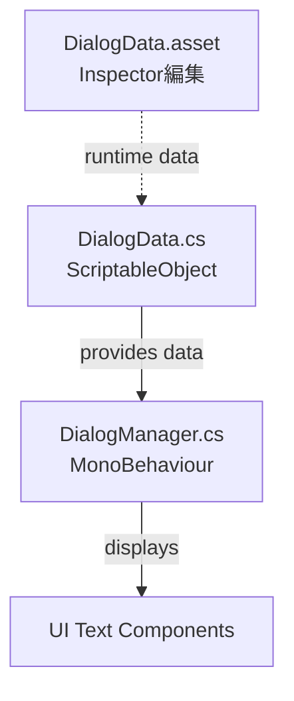

# パターン: データ外部化（Data Externalization）

ハードコードされたテキスト・設定値・パラメータを外部ファイルに分離するパターン。

---

## 問題（Before）

テキストや設定値がコード内に直書きされており、変更のたびにコード修正・再ビルドが必要。

## 解決策（After）

データを外部ファイル（JSON/YAML/ScriptableObject等）に分離し、コード変更なしに値を変更可能にする。

---

## 例1: Unity — 文字列の ScriptableObject 外部化

### Before
```csharp
public class DialogManager : MonoBehaviour
{
    void ShowWelcome()
    {
        dialogText.text = "ようこそ！冒険の世界へ";
        buttonText.text = "はじめる";
    }
}
```

### After
```csharp
[CreateAssetMenu(fileName = "DialogData", menuName = "Game/DialogData")]
public class DialogData : ScriptableObject
{
    public string welcomeMessage;
    public string startButtonText;
}

public class DialogManager : MonoBehaviour
{
    [SerializeField] private DialogData dialogData;

    void ShowWelcome()
    {
        dialogText.text = dialogData.welcomeMessage;
        buttonText.text = dialogData.startButtonText;
    }
}
```

### 変更マップ



---

## 例2: Web — API エンドポイントの環境変数化

### Before
```javascript
const response = await fetch('https://api.example.com/v1/users');
```

### After
```javascript
const API_BASE = process.env.API_BASE_URL || 'https://api.example.com/v1';
const response = await fetch(`${API_BASE}/users`);
```

`.env`:
```
API_BASE_URL=https://api.example.com/v1
```

---

## 例3: Web — UI テキストの i18n 化

### Before
```jsx
<h1>ようこそ</h1>
<button>はじめる</button>
```

### After
```jsx
import { useTranslation } from 'react-i18next';

function Welcome() {
    const { t } = useTranslation();
    return (
        <>
            <h1>{t('welcome.title')}</h1>
            <button>{t('welcome.startButton')}</button>
        </>
    );
}
```

`locales/ja.json`:
```json
{
    "welcome": {
        "title": "ようこそ",
        "startButton": "はじめる"
    }
}
```

---

## チェックリスト

- [ ] 文字列リテラルがコード内に埋め込まれていないか
- [ ] 数値パラメータがマジックナンバーになっていないか
- [ ] 環境別（dev/staging/prod）に切り替え可能か
- [ ] 非エンジニアが値を編集できるか

## 関連ドキュメント

- `templates/DESIGN_PRINCIPLES.md` — 設計原則の全体像
- `templates/diagrams/data-flow.md` — データフロー図テンプレート
