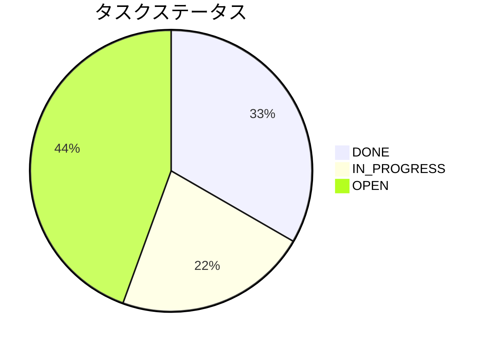
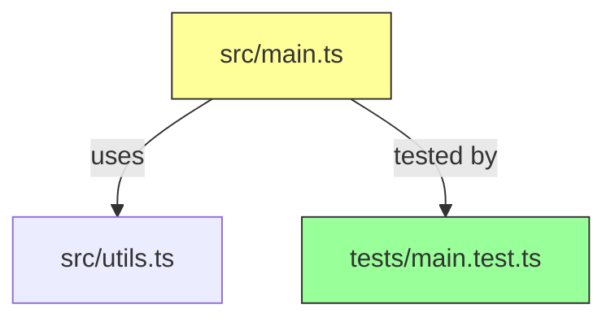
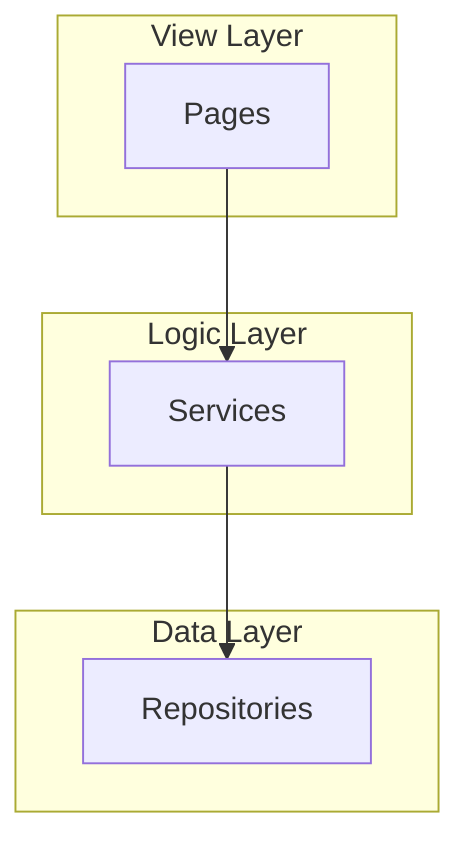
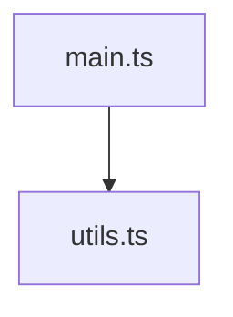

# パターン: Mermaid 図の使い方

プロジェクト横断で使う Mermaid 図の書き方と各 IDE での表示例。

---

## 基本ルール

- `data/presentation.json` の `diagram.preferred` が `"mermaid"` → Mermaid を優先
- ASCII art は原則禁止（`diagram.ascii_art: false`）
- Mermaid 非対応環境（Visual Studio 等）では Markdown テーブルにフォールバック

## 対応 IDE

| IDE | Mermaid 対応 | 備考 |
|-----|-------------|------|
| Windsurf | ✅ | チャット内で直接レンダリング |
| Google Antigravity | ✅ | チャット内で直接レンダリング |
| Cursor | ✅ | チャット内で直接レンダリング |
| VS Code | ✅ | Markdown Preview Enhanced 等で対応 |
| Visual Studio | ❌ | Markdown テーブルにフォールバック |

---

## よく使う図の種類

### 1. タスク進捗（Orchestrator `## 現状`）

テンプレート: `templates/diagrams/task-flow.md`

### 2. 変更マップ（Worker `## 変更マップ`）

テンプレート: `templates/diagrams/change-map.md`

### 3. 作業フロー（Orchestrator `## ガイド`）

テンプレート: Orchestrator が状況に応じて動的生成

### 4. データフロー（設計レビュー）

テンプレート: `templates/diagrams/data-flow.md`

### 5. アーキテクチャ（プロジェクト構成）

テンプレート: `templates/diagrams/architecture.md`

---

## フォールバック例（Mermaid 非対応環境）

Mermaid:

フォールバック（Markdown テーブル）:

| ファイル | 依存先 | 種別 |
|---------|--------|------|
| main.ts | utils.ts | import |

---

## 関連ドキュメント

- `data/presentation.json` — 表示ポリシー SSOT
- `templates/diagrams/` — 全図テンプレート集
- `docs/windsurf_workflow/IDE_COMPATIBILITY.md` — IDE 別詳細ガイド
