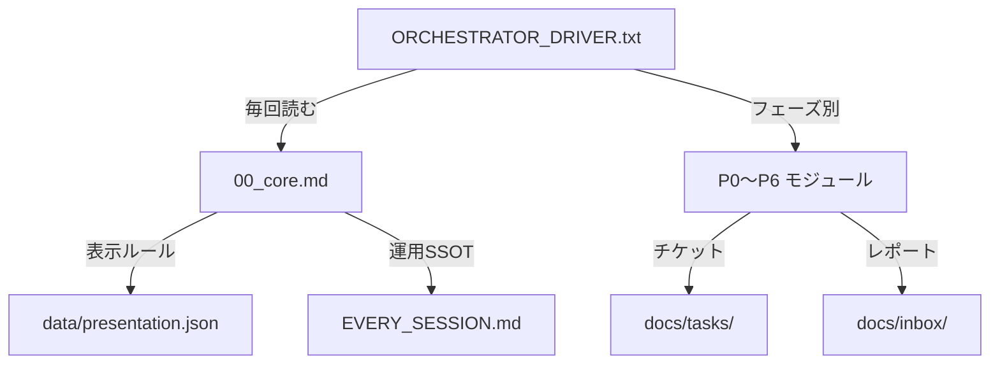

# Orchestrator Metaprompt（リファレンス）

> **注意**: このファイルはリファレンスドキュメントです。チャットに貼るのは `ORCHESTRATOR_DRIVER.txt` のみ。

## コピペ用（1つだけ）

- `prompts/every_time/ORCHESTRATOR_DRIVER.txt`

## アーキテクチャ概要

## 関連ファイル一覧

| 用途 | ファイル |
|------|---------|
| 毎回貼る | `prompts/every_time/ORCHESTRATOR_DRIVER.txt` |
| コアルール | `prompts/orchestrator/modules/00_core.md`（Testing Gate / Broad Thinking / Milestone Rhythm） |
| フェーズモジュール | `prompts/orchestrator/modules/P0〜P6_*.md`（P2.5 発散思考含む） |
| 表示ポリシー | `data/presentation.json` |
| 運用 SSOT | `docs/windsurf_workflow/EVERY_SESSION.md` |
| マイルストーン SSOT | `docs/MILESTONE_PLAN.md`（テンプレ: `templates/MILESTONE_PLAN.md`） |
| Worker テンプレ | `docs/windsurf_workflow/WORKER_PROMPT_TEMPLATE.md` |
| Worker 起動判定 | `docs/windsurf_workflow/WORKER_ACTIVATION_CHECKLIST.md` |
| 依頼反映チェック | `docs/windsurf_workflow/REQUEST_REFLECTION_CHECKLIST.md` |
| 設計原則 | `templates/DESIGN_PRINCIPLES.md`（Testing First 原則含む） |

## 運用ルール要約

- **SW_ROOT**: `.shared-workflows/`（submodule 推奨）。存在しない場合は `docs/` 直下を参照。
- **必須ルール**: 日本語応答、実装は Worker 委譲、コマンドは即実行、重要判断は3案比較。
- **コマンド実行ポリシー**: ローカル安全コマンドは自律実行。破壊的操作（reset/rebase/force push）は常に停止。
- **ダブルチェック**: Push/Merge 後は `git status -sb` 確認必須。失敗は明言し次手を提示。
- **GitHubAutoApprove**: `docs/HANDOVER.md` に記載された値に従う。未記載ならユーザーに1回確認。

## Phase 一覧（詳細は各モジュール参照）

| Phase | 名称 | モジュール | 追加機能 |
|-------|------|----------|----------|
| -1 | Bootstrap | （DRIVER 内で処理） | |
| 0 | SSOT 確認 | `P0_ssot.md` | |
| 1 | Sync & Merge | `P1_sync.md` | |
| 1.5 | 巡回監査 | `P1.5_audit.md` | |
| 1.75 | Gate | `P1.75_gate.md` | テスト検証 + マイルストーン整合 |
| 2 | 状況把握 | `P2_status.md` | マイルストーン確認 + KPT振り返り |
| **2.5** | **発散思考** | **`P2.5_diverge.md`** | **代替案分析 + Impact Radar + Devil's Advocate** |
| 3 | 分割と戦略 | `P3_strategy.md` | テスト戦略 + リスク軽減 + 目標紐付け |
| 4 | チケット発行 | `P4_ticket.md` | Test Plan必須 + Milestone必須 |
| 5 | Worker 起動 | `P5_worker.md` | Test Plan + Impact Radar 転記 |
| 6 | レポート | `P6_report.md` | マイルストーン更新 + 現在地表示 |
