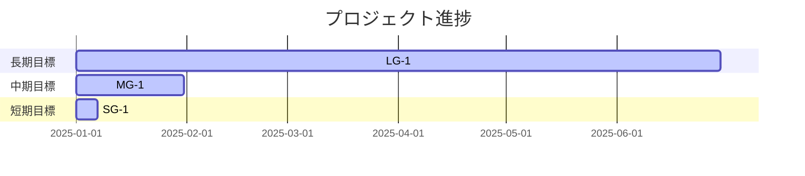

# Milestone Plan

## 基本情報

- **最終更新**: YYYY-MM-DDTHH:MM:SS+09:00
- **更新者**: AI Agent / Human

---

## 長期目標（Someday / 月次〜四半期）

### LG-1: <長期目標名>

- **ゴール**: （達成条件を1-2文で）
- **期限目安**: YYYY-MM
- **状態**: 未着手 / 進行中 / 完了
- **進捗**: 0%
- **関連マイルストーン**: MG-1, MG-2

---

## 中期目標（Later / 1〜2週間）

### MG-1: <中期マイルストーン名>

- **ゴール**: （達成条件を1-2文で）
- **期限目安**: YYYY-MM-DD
- **状態**: 未着手 / 進行中 / 完了
- **進捗**: 0%
- **含まれるタスク**: TASK_001, TASK_002, ...
- **完了基準**:
  - [ ] <基準1>
  - [ ] <基準2>
  - [ ] テスト全通過・ビルド成功

---

## 短期目標（Next / 今日〜数日）

### SG-1: <短期目標名>

- **ゴール**: （今日〜数日で達成すること）
- **対象タスク**: TASK_XXX
- **完了基準**:
  - [ ] <基準>

---

## 現在地マップ

---

## 振り返りログ（KPT）

### YYYY-MM-DD: <振り返りタイトル>（MG-X 完了時 / 5タスク完了時）

**Keep（続けること）**:

- 

**Problem（課題）**:

- 

**Try（次に試すこと）**:

- 

**優先度変更**:

- （振り返りの結果、優先度が変わったタスクがあれば記録）

---

## 履歴

- YYYY-MM-DD HH:MM: MILESTONE_PLAN.md を初期化
