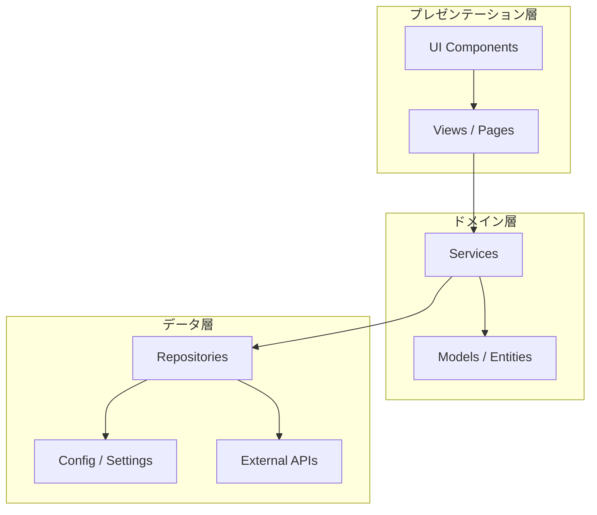
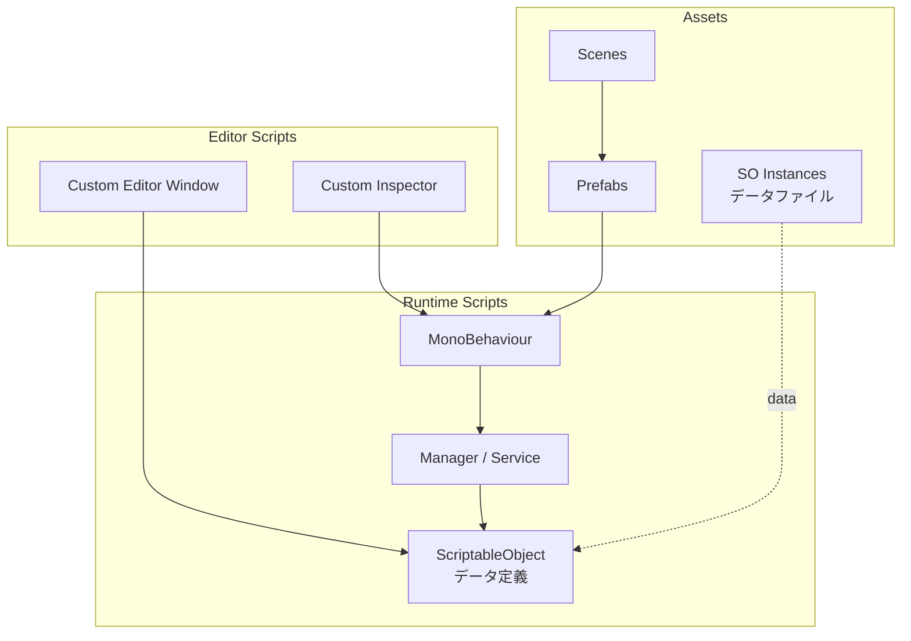

# アーキテクチャ図テンプレート

プロジェクト構成やモジュール間関係を可視化する。Orchestrator の `## ガイド` やレポートで使用。

## Mermaid: graph TD（モジュール構成）



## Mermaid: graph TD（Unity プロジェクト構成例）



## フォールバック: インデントリスト（Mermaid非対応環境用）

```
プロジェクト構成:
├── Presentation（プレゼンテーション層）
│   ├── UI Components
│   └── Views / Pages → Domain.Services
├── Domain（ドメイン層）
│   ├── Services → Data.Repositories
│   └── Models / Entities
└── Data（データ層）
    ├── Repositories → Config, External APIs
    ├── Config / Settings
    └── External APIs
```
