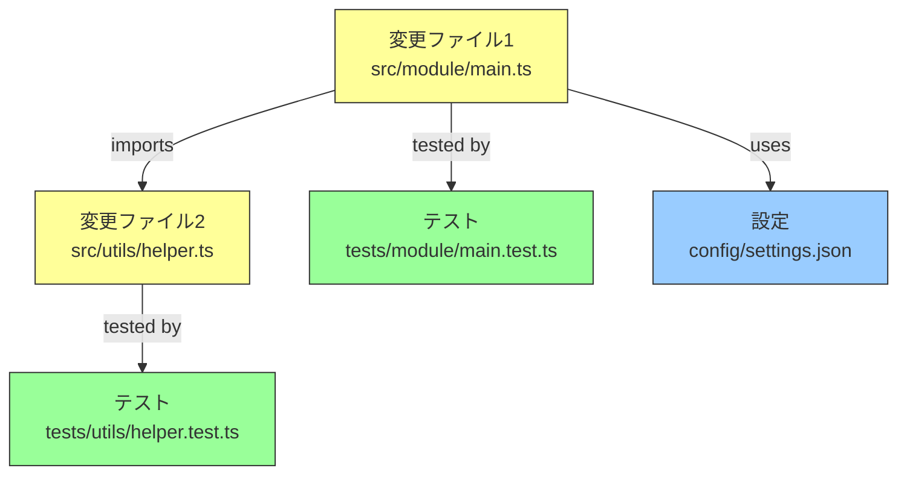

# 変更マップテンプレート

Worker の `## 変更マップ` セクションで使用する。変更したファイル/モジュール間の依存関係を可視化する。

## Mermaid: graph TD（変更影響範囲）

凡例:
- 黄色: 変更されたソースファイル
- 緑色: 関連テストファイル
- 青色: 設定/データファイル

## フォールバック: Markdown テーブル（Mermaid非対応環境用）

| 変更ファイル | 種別 | 依存先 | 影響範囲 |
|-------------|------|--------|---------|
| src/module/main.ts | Source | src/utils/helper.ts, config/settings.json | tests/module/main.test.ts |
| src/utils/helper.ts | Source | — | tests/utils/helper.test.ts |
| config/settings.json | Config | — | src/module/main.ts |
