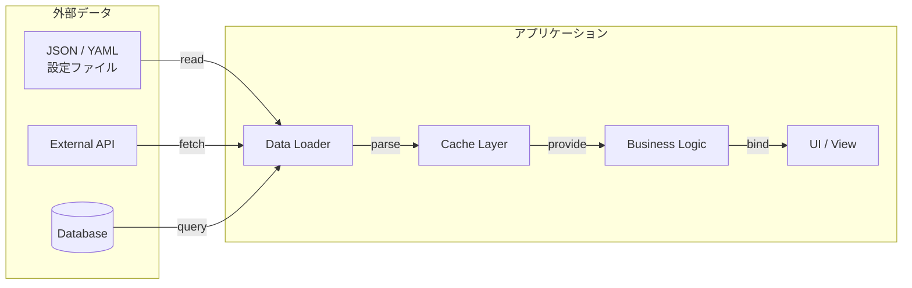
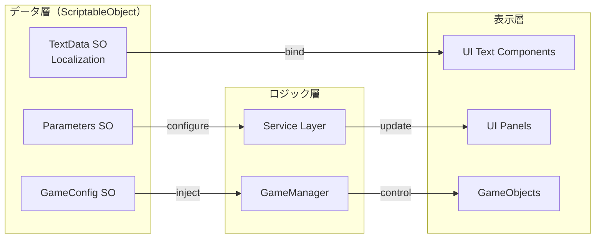

# データフロー図テンプレート

データとロジックの分離を可視化する。設計レビューやリファクタリングタスクで使用。

## Mermaid: flowchart LR（データフロー）



## Mermaid: flowchart LR（Unity データ分離パターン）



## Before/After 例: ハードコード → データ外部化

### Before（ハードコード）
```csharp
// NG: テキストがコード内にハードコード
public class DialogManager : MonoBehaviour
{
    void ShowWelcome()
    {
        dialogText.text = "ようこそ！冒険の世界へ";
        buttonText.text = "はじめる";
    }
}
```

### After（ScriptableObject に外部化）
```csharp
// OK: データをSOに分離
[CreateAssetMenu(fileName = "DialogData", menuName = "Game/DialogData")]
public class DialogData : ScriptableObject
{
    public string welcomeMessage;
    public string startButtonText;
}

public class DialogManager : MonoBehaviour
{
    [SerializeField] private DialogData dialogData;

    void ShowWelcome()
    {
        dialogText.text = dialogData.welcomeMessage;
        buttonText.text = dialogData.startButtonText;
    }
}
```

## フォールバック: Markdown テーブル（Mermaid非対応環境用）

| データ種別 | 格納先 | 参照元 | 備考 |
|-----------|--------|--------|------|
| ゲーム設定 | GameConfig.asset (SO) | GameManager | Inspector から編集可能 |
| テキスト | TextData.asset (SO) | UI Text Components | ローカライズ対応 |
| パラメータ | Parameters.asset (SO) | Service Layer | バランス調整用 |
