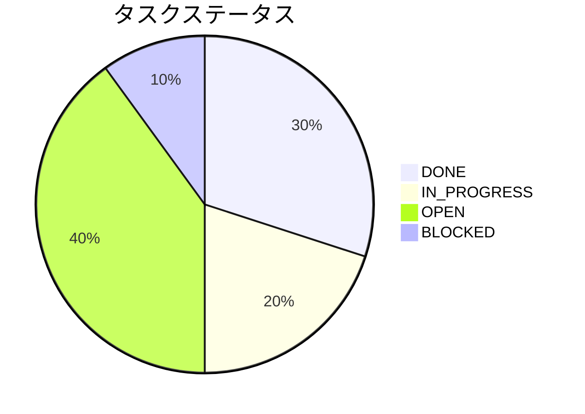
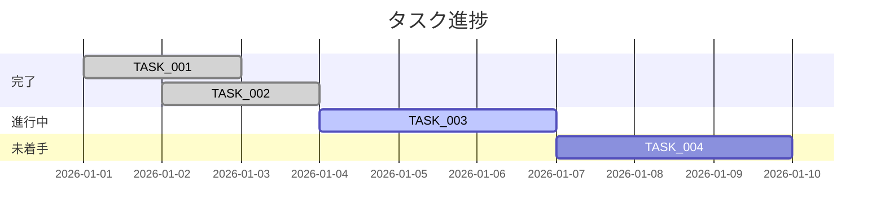

# タスク進捗図テンプレート

Orchestrator の `## 現状` セクションで使用する。タスク進捗を可視化する。

## Mermaid: pie（タスクステータス分布）

## Mermaid: gantt（タスクタイムライン）

## フォールバック: Markdown テーブル（Mermaid非対応環境用）

| タスク | ステータス | 優先度 | 進捗 |
|--------|-----------|--------|------|
| TASK_001 | DONE | High | ■■■■■■■■■■ 100% |
| TASK_002 | DONE | Medium | ■■■■■■■■■■ 100% |
| TASK_003 | IN_PROGRESS | High | ■■■■■□□□□□ 50% |
| TASK_004 | OPEN | Medium | □□□□□□□□□□ 0% |
